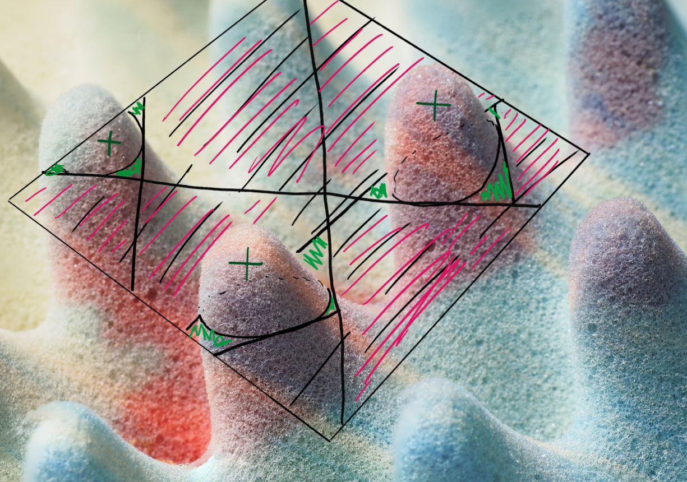

# $\AA^1$ Enumerative Geometry

Enumerative geometry, counts algebro-geometric objects, and in order to actually obtain an invariant number at the end of the day one uses an algebraically closed field $k$ or $\CC$. This is essentially because the conditions imposed are polynomial, and polynomials of degree $n$ over a closed field always have $n$ roots.

The goal here is to record information about the fields of definition. However, since we may no longer have invariant numbers as solutions to polynomial equations, we replace this with a notion of *weights* to get an "invariance of bilinear form" principle instead. Over characteristic not 2, we can use quadratic forms, which ties to Lurie's first talk.

# Example: Lines on a Smooth Cubic Surface
> Joint work with Jesse Kass

A **cubic surface** $X$ consists of the $\CC$ solutions to a polynomial in three variables, i.e. 
$$
X = \theset{(x,y,z) \in \CC^3 \suchthat f(x,y,z) = 0},
$$

where $f$ is degree 3. In general, we want to compactify, so we view $X \injects \CP^3$ as
$$
\CP^3 = \theset{\vector x = [w,x,y,z]\neq \vector 0 \suchthat \forall \lambda \in \CC^\times,~\vector x = \lambda \vector x}
$$

and so 
$$
X = \theset{[w,x,y,z] \in \CP^3 \suchthat f(w,x,y,z) = 0}
$$
where $f$ is homogeneous.

The surface $X$ is **smooth** if the underlying points form a manifold, or equivalently if the partials don't simultaneously vanish.

**Theorem (Salmon Cayley 1849):**
If $X$ is a smooth cubic surface, then $X$ contains exactly 27 lines.

Example: The Fermat cubic $f(w,x,y,z) = w^3 + x^3 + y^3 + z^3$.

We can find one line, given by 
$$
L = \theset{[s,-s,t,-t] \suchthat s,t \in \CP^1},
$$

and in fact this works for any $\lambda, \omega$ such that $\lambda^3 = \omega^3 = -1$, yielding
$$
L' = \theset{[s,\lambda s,t,\omega t] \suchthat s,t \in \CP^1}.
$$

We can also permute $s,t$ around to get more lines, and by counting this yields 27 distinct possibilities. (3 choices for $\lambda$, 3 choices for $\omega$, and $\frac 1 2 {4\choose 2}$ ways to pair them with the $s,t$ in the original $L$.

> There is a proof in the notes that these are the only lines, which is relatively elementary.

# Modern Proof
We'll use characteristic classes, which we'll later replace by an $\AA^1$ homotopy theory variant.

Let $\Gr(1,3)$ be the Grassmannian parameterizing 1-dimensional subspaces of $\CP^3$, where the $\CC$ points of this space parameterize 2-dimensional subspaces $W \subseteq \CC^4$. This is a moduli space of the lines we're looking for.

Let $$S \to \Gr(1,3)$$ be the tautological bundle where the fiber is simply given by $S_W = W$. We can also form the bundle $$(\sym^3 S)^\dual \to \Gr(1,3)$$ where the fiber over the point corresponding to $W$ is all of the cubic polynomials on $W$, i.e. $$(\sym^3 S)^\dual_W = (\sym^3 W)^\dual.$$

Explicitly, we have the following two bundles to work with:
$$
W \to S \to \Gr(1,3) \\
(\sym^3 W)^\dual \to (\sym^3 S)^\dual \to \Gr(1,3)
$$

Our chosen $f$ determines an element of $(\sym^3 \CC^4)^\dual$, which is thus a section $\sigma_f$ of the second bundle above, where
$$
\sigma_f(W) = \restrictionof{f}{W}.
$$

We thus have
$$
\PP W \in X \iff \sigma_f(W) = 0,
$$
i.e. the line corresponding to $W$ is in our surface exactly when this section is zero. We now want to count the zeros of $\sigma_f$, which is exactly what the Euler class does.

To be precise, the Euler class counts the zeros of a section of a properly oriented vector bundle with a given weight. Let $V\to M$ be a rank $r$ $\RR\dash$ vector bundle over a dimension $r$ real manifold where we assume that $V$ is oriented. 

> We choose $\RR$ here because $\CC$ is slightly too nice and gives us a preferred orientation (which we'll want to track later.)

For any section $\sigma$ with only isolated zero, we'll assign a weight to each zero which comes from the topological degree function
$$
\deg: [S^{r-1}, S^{r-1}] \to \ZZ,
$$

where we use the brackets to denote homotopy classes of maps.

Definition: Let $p\in M$ where $\sigma(p) = 0$, and define $\deg_p(\sigma)$ in the following way:

Choose local coordinates near $p$. Since the zeros are isolated, we can choose a ball $B_\varepsilon(p)$ such that $x\in B_\varepsilon(p) - \theset{p} \implies \sigma(x) \neq 0$. Choose a local trivialization of the total space $V$. This allows us to view $\sigma: \RR^r \to \RR^r$ as a real function.

We can choose coordinates such that $p = 0$ in the domain, so $\sigma(0) = 0$, and moreover the image $\sigma(B_\varepsilon(p)) = \RR - \theset{0}$. We can then form a function 
$$
\bar\sigma: \del B_\varepsilon(p) = S^{r-1} \to S^{r-1} = \del \sigma(B_\varepsilon(p)) \\
x \mapsto \frac{\sigma(x)} {\norm{\sigma(x)}},
$$

and so we can take $\deg_p(\sigma) \definedas \deg \bar \sigma$.

There is indeterminacy here up to elements of $\GL(r, \RR)$ which could possibly effect the sign, however, but this can be fixed using the assumption that $V$ is oriented and choosing local trivializations for which the orientations are compatible. This gives us a well-defined local degree of a section at a zero.

The Euler class, which only depends on the bundle and not the section, is given by 
$$
e(V) = \sum_{p\suchthat \sigma(p) = 0} \deg_p(\sigma).
$$

It can be shown that because $X$ is smooth, the zeros are all simple and so in the complex case, the degrees are all 1. We thus obtain
$$
\abs{\theset{\text{lines on } X}} = e((\sym^3 S)^\dual),
$$

where the RHS is independent of $X$ and can be computed using the splitting principle and the cohomology of $\Gr$. $\qed$

# What about $\RR$?

Schlafli, 19th century: $X$ can have $3,7,15$ or $27$ lines. So it's not constant, and thus there's not an invariant number here, but Segre (1942) distinguished between hyperbolic and elliptic lines.

Recall the characterization of elements in $\Aut L$ for $L=\RP^1$ (real lines) as elliptic/hyperbolic: we have $\Aut L \cong \mathrm{PGL}(2, \RR)$, so pick some $I$ corresponding to a matrix
$$
[I] = \pmatrix{a & b \\ c & d},\quad  z\mapsto \frac{az+b}{cz+d}
$$

where the second formulation above shows that there are two fixed points, since solving for $z\mapsto z$ yields a quadratic equation. So we have
$$
\mathrm{Fix}(I) = \theset{z \in \CC \suchthat cz^2 + (d-z)z + b = 0},
$$
and we characterize $I$ by the following cases:
- $\mathrm{Fix}(I)$ contains two real points: hyperbolic
- A complex conjugate pair: elliptic

So we'll associate an involution to $L$, and port over these notions of hyperbolic/elliptic. As we'll see later, for each point on $L$, there will be a unique other point that has the tangent space, and this involution will swap them.

Let $p\in L$, and consider $T_pX \intersect X$ . Since $L$ is in both of the varieties we're intersecting here, and we can apply Bezout's theorem, we know that its complement will some degree 2 variety $Q$ (since the total degree is 3).

So we can write $T_pX \intersect X = L \union Q$. We know that $L \intersect Q$ will be the intersection of a degree 1 and a degree 2 curve, which will have 2 points of intersection. At one of these points, say $p$, $Q$ and $L$ will intersect transversally, and so the tangent vectors $T_pQ$ and $T_pL$ give a 2-dimensional frame, which yields a plane $P \subseteq T_pX$. Since $X$ is smooth, we get equality and $P = T_pX$.

This also holds for the second point of intersection, $p'$, and so we take the involution $I(p) = p'$ and vice-versa. We then say $L$ is elliptic/hyperbolic exactly when $I$ is.

A natural way to see that there should be a distinction between two types of lines is to use spin structures. Consider a physical cubic surface sitting inside $\RR^3$, and push the tangent plane alone a line. There are two things that can happen -- one is a twisting by a nontrivial element of $\pi_1 SO_3(\RR)$, the other is no twisting at all.

Example: Look at the Fermat cubic surface $x^3+y^3+z^3=-1$

Interpretation of this image: $X \subset \RR^3$ is a surface, which has 3 lines that are contained in a plane. We this view $X$ from above this plane, marking a plus/minus to denote the relative height of the surface within each bounded region. Plus denotes part of the surface that bubbles up over the plane, having positive height/$z$ coordinates, etc.

> This took me a while to visualize -- what worked for me was thinking about "egg crate" padding:

After thinking about what physically happens as you push a plane around, it becomes clear that these three lines are all hyperbolic. Note that this question is the same as asking if a path in the frame bundle lifts.

Although the number of lines isn't a constant, we can take a "signature" sort of formula to obtain an invariant. In this case, the number hyperbolic lines minus the number of elliptic lines *is* constant. In this case, the constant is 3.

General mantra for $\AA^1$ homotopy theory: if you have a result that works over $\CC$ and $\RR$, it may be a result in $\AA^1$ theory that has realizations recovering the original results.

# $\AA^1$ Homotopy Theory
This will allow us to do with schemes much of what we can do in $\mathbf Top$. Smooth schemes behave like manifolds, where there are balls around points. The convention here will be that we're working over smooth schemes, denoted $\mathrm{Sm}_k$ where $k$ is a field.

> Remark: in my notation I use $\RP^n, \CP^n$, and $\PP^n(k)$ to denote various projective spaces. I'll adopt Kirsten's convention here and just denote $\PP^n(k)$ as $\PP^n$.

We'll get spheres from $S_\AA^n \definedas \PP^n/\PP^{n-1}$.. One nice result due to Morel is that there is a degree map
$$
[S_\AA^n, S_AA^n] \to GW(k),
$$

where the target is not the integers in this case, but rather a group of bilinear forms that are quadratic in characteristic not equal to 2. It is the Grothendieck-Witt group, whose elements are formal difference of bilinear forms. 

Thus the group itself is the group completion of nondegenerate symmetric isomorphism classes of bilinear forms $V^2 \to k$ where $V$ is a finite-dimensional $k\dash$vector space.

The group structure arises because if we have two bilinear forms $B, B'$ on vector spaces $V, W$ respectively, then we can define a new form on $V \oplus W$ by working in components and declaring orthogonality between any of the factors. We then take formal differences of these, and inherit a ring structure from the tensor product of forms.

Bilinear forms over fields can all be diagonalized, although in characteristic 2, this only holds in a stable sense.

Since we can diagonlize, the group $GW(k)$ has a presentation coming from the one dimensional forms. Any of these work as a generator, so we have

- Generators: $<a>$ where $a\in k^\times$, corresponding to the form
$$
<a> : k^2 \to k\\
(x,y) \mapsto axy
$$
- Relations: if we change the basis of $k$ using a multiplication by $b\in k^\times$, we get $<ab^2>=<a>$. (This means that $a \in k^\times/(k^\times)^2$
  - We also get $<a> + <b> = <a+b> + <ab(a+b)>$

There are many concrete computations of this known for global fields, local fields, finite fields, function fields, etc.

Example: compute $GW(\CC)$.

The generators are in bijection with $k^\times/(k^\times)^2$, but since every element of $\CC$ is a square, so there's only one element here. We thus obtain
$$
GW(\CC) \mapsvia{\cong} \ZZ,
\beta \mapsto \dim V
$$

which is realized by taking the rank.

Example: $GW(\RR)$
We still have the rank, but now we can also take the signature, so we have
$$
GW(\RR) \mapsvia{\cong} 
$$

