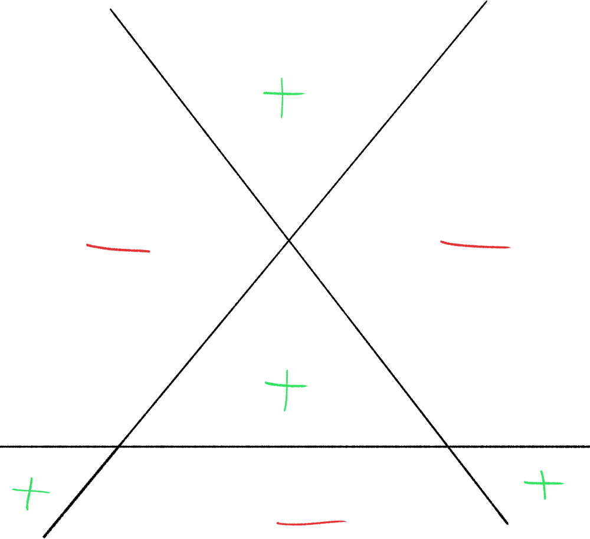

---
title: 'A1 Enumerative Geometry'
author: 'Kirsten Wickelgren'
date: 'March 9, 2019'
output:
    custom_document: {path: Wickelgren.tex, pandoc_args: ['-r', markdown+tex_math_dollars+simple_tables+table_captions+yaml_metadata_block+smart, '-t', latex, '--template=/home/zack/Notes/Latex/pandoc_template.tex']}
---  
  
  
Arizona Winter School 2019
Speaker: Kirsten Wickelgren
Topic:  Enumerative Geometry
  
- [Lecture 1](#lecture-1 )
- [Lecture 2](#lecture-2 )
- [Lecture 3](#lecture-3 )
- [Lecture 4](#lecture-4 )
  
# Lecture 1
  
  
#  Enumerative Geometry
  
  
Enumerative geometry counts algebro-geometric objects, and in order to actually obtain an invariant number at the end of the day one uses an algebraically closed field  or . This is essentially because the conditions imposed are polynomial, and polynomials of degree  over a closed field always have  roots.
  
The goal here is to record information about the fields of definition. However, since we may no longer have invariant numbers as solutions to polynomial equations, we replace this with a notion of *weights* to get an "invariance of bilinear form" principle instead. Over characteristic not 2, we can use quadratic forms, which ties to Lurie's first talk.
  
# Example: Lines on a Smooth Cubic Surface
  
> Joint work with Jesse Kass
  
A **cubic surface**  consists of the  solutions to a polynomial in three variables, i.e. 

  
  
  
where  is degree 3. In general, we want to compactify, so we view  as

  
  
  
and so 

  
  
where  is homogeneous.
  
The surface  is **smooth** if the underlying points form a manifold, or equivalently if the partials don't simultaneously vanish.
  
**Theorem (Salmon Cayley 1849):**
If  is a smooth cubic surface, then  contains exactly 27 lines.
  
Example: The Fermat cubic .
  
We can find one line, given by 

  
  
  
and in fact this works for any  such that , yielding

  
  
  
We can also permute  around to get more lines, and by counting this yields 27 distinct possibilities. (3 choices for , 3 choices for , and  ways to pair them with the  in the original .
  
> There is a proof in the notes that these are the only lines, which is relatively elementary.
  
# Modern Proof
  
We'll use characteristic classes, which we'll later replace by an  homotopy theory variant.
  
Let  be the Grassmannian parameterizing 1-dimensional subspaces of , where the  points of this space parameterize 2-dimensional subspaces . This is a moduli space of the lines we're looking for.
  
Let 

  
 be the tautological bundle where the fiber is simply given by . We can also form the bundle 

  
 where the fiber over the point corresponding to  is all of the cubic polynomials on , i.e. 

  
  
  
Explicitly, we have the following two bundles to work with:

  
  
  
Our chosen  determines an element of , which is thus a section  of the second bundle above, where

  
  
  
We thus have

  
  
i.e. the line corresponding to  is in our surface exactly when this section is zero. We now want to count the zeros of , which is exactly what the Euler class does.
  
To be precise, the Euler class counts the zeros of a section of a properly oriented vector bundle with a given weight. Let  be a rank   vector bundle over a dimension  real manifold where we assume that  is oriented. 
  
> We choose  here because  is slightly too nice and gives us a preferred orientation (which we'll want to track later.)
  
For any section  with only isolated zero, we'll assign a weight to each zero which comes from the topological degree function

  
  
  
where we use the brackets to denote homotopy classes of maps.
  
Definition: Let  where , and define  in the following way:
  
Choose local coordinates near . Since the zeros are isolated, we can choose a ball  such that . Choose a local trivialization of the total space . This allows us to view  as a real function.
  
We can choose coordinates such that  in the domain, so , and moreover the image . We can then form a function 

  
  
  
and so we can take .
  
There is indeterminacy here up to elements of  which could possibly effect the sign, however, but this can be fixed using the assumption that  is oriented and choosing local trivializations for which the orientations are compatible. This gives us a well-defined local degree of a section at a zero.
  
The Euler class, which only depends on the bundle and not the section, is given by 

  
  
  
It can be shown that because  is smooth, the zeros are all simple and so in the complex case, the degrees are all 1. We thus obtain

  
  
  
where the RHS is independent of  and can be computed using the splitting principle and the cohomology of .
  
# What about ?
  
  
Schlafli, 19th century:  can have  or  lines. So it's not constant, and thus there's not an invariant number here, but Segre (1942) distinguished between hyperbolic and elliptic lines.
  
Recall the characterization of elements in  for  (real lines) as elliptic/hyperbolic: we have , so pick some  corresponding to a matrix

  
  
  
where the second formulation above shows that there are two fixed points, since solving for  yields a quadratic equation. So we have

  
  
and we characterize  by the following cases:
-  contains two real points: hyperbolic
- A complex conjugate pair: elliptic
  
So we'll associate an involution to , and port over these notions of hyperbolic/elliptic. As we'll see later, for each point on , there will be a unique other point that has the tangent space, and this involution will swap them.
  
Let , and consider  . Since  is in both of the varieties we're intersecting here, and we can apply Bezout's theorem, we know that its complement will some degree 2 variety  (since the total degree is 3).
  
So we can write . We know that  will be the intersection of a degree 1 and a degree 2 curve, which will have 2 points of intersection. At one of these points, say ,  and  will intersect transversally, and so the tangent vectors  and  give a 2-dimensional frame, which yields a plane . Since  is smooth, we get equality and .
  
This also holds for the second point of intersection, , and so we take the involution  and vice-versa. We then say  is elliptic/hyperbolic exactly when  is.
  
A natural way to see that there should be a distinction between two types of lines is to use spin structures. Consider a physical cubic surface sitting inside , and push the tangent plane alone a line. There are two things that can happen -- one is a twisting by a nontrivial element of , the other is no twisting at all.
  
Example: Look at the Fermat cubic surface 
  

  
Interpretation of this image:  is a surface, which has 3 lines that are contained in a plane. We this view  from above this plane, marking a plus/minus to denote the relative height of the surface within each bounded region. Plus denotes part of the surface that bubbles up over the plane, having positive height/ coordinates, etc.
  
> This took me a while to visualize -- what worked for me was thinking about "egg crate" padding:
  

  
After thinking about what physically happens as you push a plane around, it becomes clear that these three lines are all hyperbolic. Note that this question is the same as asking if a path in the frame bundle lifts.
  
Although the number of lines isn't a constant, we can take a "signature" sort of formula to obtain an invariant. In this case, the number hyperbolic lines minus the number of elliptic lines *is* constant. In this case, the constant is 3.
  
General mantra for  homotopy theory: if you have a result that works over  and , it may be a result in  theory that has realizations recovering the original results.
  
#  Homotopy Theory
  
This will allow us to do with schemes much of what we can do in . Smooth schemes behave like manifolds, where there are balls around points. The convention here will be that we're working over smooth schemes, denoted  where  is a field.
  
> Remark: in my notation I use , and  to denote various projective spaces. I'll adopt Kirsten's convention here and just denote  as .
  
We'll get spheres from .. One nice result due to Morel is that there is a degree map

  
  
  
where the target is not the integers in this case, but rather a group of bilinear forms that are quadratic in characteristic not equal to 2. It is the Grothendieck-Witt group, whose elements are formal difference of bilinear forms. 
  
Thus the group itself is the group completion of nondegenerate symmetric isomorphism classes of bilinear forms  where  is a finite-dimensional vector space.
  
The group structure arises because if we have two bilinear forms  on vector spaces  respectively, then we can define a new form on  by working in components and declaring orthogonality between any of the factors. We then take formal differences of these, and inherit a ring structure from the tensor product of forms.
  
Bilinear forms over fields can all be diagonalized, although in characteristic 2, this only holds in a stable sense.
  
# The Grothendieck-Witt Group
  
Since we can diagonalize, the group  has a presentation coming from the one dimensional forms. Any of these work as a generator, so we have
  
- Generators:  where , corresponding to the form

  
  
- Relations: if we change the basis of  using a multiplication by , we get . (This means that 
  - We also get 
  
There are many concrete computations of this known for global fields, local fields, finite fields, function fields, etc.
  
**Example:** Computing .
  
The generators are in bijection with , but since every element of  is a square, so there's only one element here. We thus obtain

  
  
  
which is realized by taking the rank.
  
**Example:** .
We still have the rank, but now we can also take the signature, so we have

  
  
  
although a minor parity issue crops up here that can be fixed without damaging the isomorphism type.
  
**Example:** .
We can make a matrix out of how  acts on basis elements and take the determinant of it to obtain an invariant called the *discriminant*, and so

  
  
  
Note that the quotient is needed because we can change basis in , which amounts to conjugating by a matrix , and so this discriminant is only well-defined up to squares.
  
# Euler Class
  
There is an Euler class in this setting,

  
  
  
Letting  be a smooth cubic surface over , then a line  will be a closed point of the Grassmannian , so we can think of it as points of the form

  
  
  
where the extension field  is obtained by adjoining the coefficients to . 
  
> I think these are always separable, mentioned later in the talk.
  
We thus get

  
  
  
Given such a line , similar to the real setting, we obtain an involution  after choosing coordinates. We also find that  again falls into two cases:
-  points, or
- 2 conjugate points in some quadratic extension  where . These correspond to the oddities in the tangent plane in the real case.
  
We then define

  
  
  
or equivalently  when , in which case .
  
# An Analogous Trace Formula
  
  
**Theorem:**
Supposing  is a smooth cubic surface over  of characteristic not equal to 2, we then have

  
  
  
where the trace/transfer maps are defined as 
  

  
  
  
where  comes from summing the conjugates. Note that we can do this because we can view  as a vector space over either  or , so we end up with a quadratic form over .
  
> Note: we have a well-defined map in the other direction, since the  is a stable homotopy group of spheres.
  
**Example:** Let , then apply rank to get  on the RHS, while since every element is a square, the Type is just 1, so we get 27 total.
  
**Example:** Let , apply signature. If  is defined over , so the type is 1, and we're just left with the trace of  -- but this contributes a  and , so there is no contribution. What's left are the lines of , and since we set it up so type 1 lines are hyperbolic, we just get the trace .
  
**Example:** Let . We can define lines in , and the "begin a square" partitions  into two disjoint subsets, we can assign types and we let squares be the hyperbolic elements.
  
We thus get

%20}%20&#x5C;&#x5C;%20%20%20%20%20%20&#x5C;text{with%20}%20}%20-%20&#x5C;mltext{%20%20%20%20&#x5C;text{Hyperbolic%20lines%20}%20&#x5C;&#x5C;%20%20%20%20&#x5C;text{with%20}}%20&#x5C;equiv%200%20&#x5C;mod%202"/>
  
  
  
which follows from computing the discriminant of the given form.
  
  
# Lecture 2
  
  
# User's Guide to  Homotopy Theory
  
Particularly, arithmetically enriching enumerative results. The first part of this talk focuses on setting up the correct category for this theory.
  
  
## Adding Colimits
  
Recall from last time that we wanted to form a space analogous to a sphere, given by , which we get from a **colimit**

  
  
  
which is the same as requiring that for maps from the total space into the quotient, maps coming from the quotiented space and maps coming from the point agree when the compositions are taken.
  
**Example:** Another example of a colimit is the union, which is given by

  
  
  
These correspond to crushing and gluing operations, which we can do with topological spaces and would like to do with schemes as well. We'd also like smooth schemes to behave like smooth manifolds, in the sense that we can take an open ball around each point. This is part of what  homotopy theory buys us.
  
We want colimits, so we add them: let  to be the category of smooth schemes over . There is a Yoneda embedding

  
  
  
where one might normally require the target to be sets, but since we'd like homotopy colimits and to be able to do things analogous to fibrant/cofibrant replacements, we aim for simplicial sets instead which can essentially be regarded as topological spaces. We can also identify the target with presheaves on the category of smooth schemes.
  
We're building a category for a homotopy theory, which means we need either
- A simplicial model category, or
- An category
  
Both have notions of fibrations, cofibrations, an associated homotopy category, weak equivalences, etc, and  has this structure. 
  
## Preserving Old Colimits: Picking a Topology
  
This construction is essentially "freely adding colimits". Since  had colimits (e.g. the union/intersection of open sets), we want  to preserve these. We fix this be forcing certain maps to be equivalences using **Bousfield localization**.
  
This is carried out by looking at open covers

  
  
  
and making a simplicial object out of this map and forcing a weak equivalence

  
  
  
> Note: this may be the Cech nerve, not entirely sure. Pretty sure I got the notation wrong though.
  
This gives us a localization functor

  
  
  
for  a Grothendieck topology which declares certain classes of maps to be covers. We have some choices of topology here, roughly in order of increasing number of open sets:
- Zariski (on schemes)
- Nisnevich
- Etale
  
**Definition:**  A map  (not necessarily smooth) is **etale** at a point  if the induced map on tangent/cotangent spaces is an isomorphism:

  
  
  
**Definition:** A map  is an **etale cover** if it is etale and surjective
  
**Definition:** A map  is a **Nisnevich cover** if it is an etale cover and .
  
This topology has a few nice properties:
- Smooth schemes have etale maps into , inclusions/closed immersions  induce maps 
- Satisfies descent for K-theory
- The cohomological dimension equals the Krull dimension 
- Cohomology can be computed Cech complexes
- More listed in Voevodsky's original paper
  
## Contracting the Affine Line
  
  
The last step is forcing  to be contractible, i.e. , which will come from another localization . This composition will land us in the homotopy theory we want:

  
  
  
where  is the choice of the Nisnevich topology, and so we'll call  our  homotopy theory.
  
# Making Spheres
  
  
Given two pointed spaces , we have

  
  
  
In topology, we have . In  homotopy theory, we have functors to simplicial sets, and so we can take constant functors, and in particular any element space living in simplicial sets is in our new homotopy theory as well. So we have , we can also take , and so we have spheres

  
  
  
Some of these end up being familiar spaces. For example, we can look at the colimit

  
  
  
which follows from the fact that  (yielding the top-right copy of ), and we can take a neighborhood around the point at  to obtain the bottom-left copy -- these intersect in .
  
So  is the colimit of maps from  to a point, so we can conclude that .
  
We can also show . This will rely on a general fact about the colimit of  with its projections is a suspension, given by

  
  
  
and so we can proceed by induction on the following diagram:

  
  
  
We also have . This can be show because  because  is trivial and we can homotop the embedded  down to the origin, giving a line bundle over . We can then cut out the copy of  at infinity, yielding , where the last equality comes from looking at a similar colimit diagram as earlier.
  
# Thom Spaces
  
These can be made out of vector bundles, which will prove to be useful in viewing smooth schemes like manifolds. Let  be an algebraic vector bundle. Then the Thom space 
  

  
  
where  here corresponds to the zero section,  is the trivial line bundle, and  is the projectivization of  where the coordinate is zero.
  
> Note: If this was a virtual vector bundle, we could make a Thom spectrum.
  
The next theorem gives us neighborhoods around points
  
**The Purity Theorem**:
Let  be a closed immersion in . Consider , in topology we could take a tubular neighborhood around  and view this as a neighborhood mod its boundary. This is equivalent to , the Thom space of the normal bundle of  in .
  
**Example:** Let  and , then let  be a Zariski open neighborhood of . Then  since the Thom space is just a vector space here. So this produces a sphere around .
  
**Example:** Replace  with , this yields 
> Note: video says "disjoint basepoint" here and uses different notation, may not be correct.
  
Compare to manifolds: if  a small ball, then . So if we wanted to look at maps between boundaries, we could suspend and take degrees.
  
# The Grothendieck-Witt Group
  
Recall that the target of the degree map was ; we'll also talk a bit about Milnor K-theory .
  
From yesterday, we defined  as the isomorphism classes of symmetric nondegenerate bilinear forms over , which had a generators

  
  
  
and relations

  
  
  
which follows because we're in . Note that the last relation is very important.
  
These relations imply a special relation concerning a **hyperbolic form,** which is given by 

  
  
for any .
  
We'll look at invariants on bilinear forms -- for many common fields, there are algorithms to determine equality of sums of generators, and thus in  there are many tools to work with. Some of these tools are invariants arising from the Milnor conjecture, which involves this group and is a huge achievement in  homotopy theory.
  
We have a **rank homomorphism:**

  
  
  
and the **fundamental ideal** is defined as . This yields a filtration

  
  
  
where the associated graded are etale cohomology groups and (by the Milnor conjecture) Milnor K-theory groups.
  
# Milnor K-Theory
  
  
We define **Milnor K-theory** as

  
  
  
which is tensor algebra on , modded out by the Steinberg relation.
  
**Theorem: The Milnor Conjecture (Voevodsky)**
There is a map

  
  
  
We can also look at the Kummer map coming from the short exact sequence

  
  
  
which lets us make a map 

  
  
  
where we can use that fact that  to land in Milnor K-theory,

  
  
  
where we can use the cup product to lift this to a map to the th graded piece

  
  
  
Fitting all of this together, we get maps

  
  
  
and the Milnor conjecture states that these are isomorphisms.
  
In other words, the associated graded of this filtration is the etale cohomology or Milnor K-theory, and if you have a field for which the th etale cohomology in  coefficients doesn't vanish, then there is a nontrivial piece in the associated graded. 
  
# Grothendieck-Witt Group Invariants
  
  
This lets us view maps  as invariants on . 
- For , this is the rank homomorphism.  
- For  we get the discriminant, which is the determinant of the linear map associated to the bilinear form obtained after choosing a basis.
- For  this is the Hasse-Witt invariant (see written notes)
- For  this is the Arason invariant
  
For higher  these invariants don't have names, but for various fields, the lower degrees form a complete invariant -- for example, for finite fields, one needs only check , while  requires .
  
The Grothendieck-Witt group is the 0th graded piece of Milnor-Witt K-theory, , which is also a homotopy group of spheres in  homotopy theory (due to Hopkins and Morel). 
  
This group has generators
  

  
  
  
and relations
  

  
  
  
where  is the same as earlier, but since it's in the wrong group, we need to define this using the isomorphism

  
  
  
# Degree Theorem
  
This theorem says that  corresponds to a Hopf map.
  
**Theorem (Morel):**

  
  
  
where the square brackets correspond to homotopy classes of maps.
  
In particular, when , we obtain

  
  
  
> This is a fantastic theorem, which we will see again later when doing oriented Chow groups.
  
A nice consequence is that if we let , the degrees behave nicely, characterized by the commutativity of this diagram:

  
  
  
where the edge degree maps are just the topological degree of maps between spheres and the middle is the  degree. The signature is the usual difference in s occurring after diagonalization. Thus  lets us simultaneously read off the real and complex degrees of maps between schemes over .
  
So these homotopy groups are actually homotopy sheaves (not just global sections of sheaves), where we can form a sheaf by taking smash with  and sheafifying. Thus  and  are all global sections of sheaves.
  
> Not sure what  is here.
  
  
# Producing a Sheaf
  
There is a procedure in Morel's book for producing an unramified sheaf  from the values on fields, i.e.  for some  of finite type. It proceeds as follows:
  
We want to know what the sections are on some scheme , so we look at its function field and check  on it to see which sections are defined over all of  and not over the generic point. This produces the additional data of boundary/residue maps that determine when sections extend globally. 
  
So let  be a valuation and  and choose a uniformizer  such that . Then form the residue field . Then this residue map plus the sections will allow us to define a sheaf, so define the **residue homomorphism**
  

  
  
  
where  and  is the reduction.
  
> Note that it is true that , and this is part of what uniquely defines this map. However, we can't have , because this does not decrease the degree by 1.
  
So then the sections on  are given by

  
  
  
and there is a procedure for making a sheaf from this denoted .
  
The fact this is a stable homotopy sheaf provides some transfers (seen last time), which we'll start with next time.
  
  
  
# Lecture 3
  
  
  
  
  
# Transfers
  
  
## Defining Some Transfers
  
Recall that we have the sheaves , and the sheaf property means that an inclusion  induces a map . We can take , and this is exactly the restriction/base change given by  of bilinear forms.
  
We also saw that these were stable homotopy sheaves, so there should be transfers, and we want to use them for field extensions. Let  be a finite extension of finite-type schemes over . This leads to transfer maps

  
  
  
There is also a geometric transfer (which is the prettiest!) which we'll define momentarily, given by with multiplication by one of those brackets to define a cohomological transfer. The geometric transfer will depend on a sequence of generators, while, while this choice can be removed for the cohomological transfer. If you use the twisting data you can get an absolute transfer. 
  
In the case where  is separable, there is a canonical way to explicitly untwist, and the absolute and cohomological transfers agree.  For these two, we took

  
  
where we now view  as a vector space, and  is the trace from Galois theory, the sum of the Galois conjugates.
  
We'll show that we have this structure for the geometric transfer. If , so we've chosen some generator, then we get an induced map . Since this is a closed immersion corresponding to , we can form a backwards map 

  
  
by crushing everything but , where the last equivalence was seen in the previous lecture. But now we can take , which is a map

  
  
  
So we have some transfers.
  
## Bilinear Forms on Chow Groups
  
  
The finale of this morning was going to be adding bilinear forms to Chow groups for the purposes of having a tool in enumerative geometry. So let  and  codimension  reduced, irreducible subschemes of . Then 

  
  
  
where  is rational equivalence, the equivalence relation generated by taking subvarieties of  and equating the fibers and the endpoints , i.e. .
  
These are useful in enumerative geometry -- there are Chern classes, pushforwards, pullbacks, a ring structure, etc. This ring structure lets us do intersection theory, providing some machinery to help with enumerative questions.
  
The th Chow group, in addition to being a motivic homology group, also has a nice formula due to Bloch that applies in the case of smooth schemes:  where the RHS is the Nisnevich cohomology of  with coefficients in Milnor theory.
  
Oriented Chow groups (AKA Chow-Witt groups) which are the original Chow groups together with a bilinear form. By Borge and Morel, motivated by the Bloch formula above, these can be defined as 

  
  
  
This can be computed by a complex (as in Morel's book):

  
  
  
where  is the function field, and since  has a generic point, we can take the highest wedge power of the tangent space of  at  to yield the determinant term, which serves as an added twist. This explains why elements of the oriented Chow are formal combinations of codimension  subvarieties  and a bilinear form over , .
  
There's structure here -- Fasel developed ring structure and pushforwards, while in the context of enumerative geometry, Mark Levine works with these. All in all, we have pullbacks, pushforwards, a noncommutative ring structure, and we can twist these groups as well.
  
## Twisted Chow
  
  
First we'll define the twists appearing in the complex above, and then we can define how to do twisted Chow so we can do pushforwards.
  
If  is a field of finite type over , then  ("twisted by ") where  is a 1-dimensional vector space can be defined as 

  
  
  
since  acts of the LHS due to the bracket  in the Grothendieck-Witt group, and the RHS is possible because we can act on the nonzero elements of the vector space. 
  
We can also twist by line bundles , leading to a definition of **oriented Chow groups twisted by local coefficients** via  where we just take Milnor-Witt and twist by .
  
For any proper  where , then we have a pushforward map 

  
  
  
where  is the canonical line bundle of  over  given by , the determinant of the tangent bundle of , and  is the pullback of any line bundle from .
  
Note that the bilinear form here acts like an orientation (which is exciting!), hence the name.
  
# Degree by Local Degree
  
  
Recall from Algebraic Topology that if we have a smooth map , then there is a notion of degree given picking regular values , so the preimage consists of finitely many points , and we define  to be the sum of local degrees. There is a formula for computing the degree from differential topology,  given by choosing coordinates  near  and  near  which are compatible with orientations. Then , so we can form its Jacobian  where that matrix  is given by . We then have

%20&#x5C;&#x5C;%20%20%20%20-1,%20&amp;%20.&#x5C;end{cases}"/>
  
  
  
In  algebraic topology, instead of just remembering the sign (like the signature), the idea of Lannes-Morel is to remember the entirety of . Take  over a field , then let  be a rational point so that . We can then define

  
  
  
which doesn't depend on . We then make an analogous definition for higher dimensions.
  
**Proposition:** the global degree is a sum of local degrees. 
Let  be finite such that  for some chosen copy of . This yields an induced map . We then define the global degree by picking some  and setting

  
  
  
where the local degree can be define using balls (as in the first lecture), and we let  be the degree of the composite map

  
  
  
where  is an open set chosen such that the preimage of  only contains , and  is the Thom space of the normal bundle (here, the tangent bundle) and the last equality follows from the purity theorem and the fact that everything is rational (i.e. ).
  
This can also be made to work at a non-rational point, using the Hatcher-style proof, of taking a collapsing map to yield the composite

  
  
  
This yields a notion of local degree in terms of global degree, by taking boundaries of balls, and we have the following facts:
  
- If  is etale at , and  is separable then 

  
  
  - Depending on what you mean by transfer, the hypothesis of separability can be dropped, but it's needed here to take the composition with the Galois theory trace.
  - We could use this to compute the degree, but we are missing something
  
  
**Question:** what happens if ? Answer: The Eisenbud-Levine-Khimshiashvili signature formula, which says that if  where  is an isolated zero, then  which is a bilinear quadratic form on 

  
  
  
where the numerator is localized at zero. Since the zero was isolated in its fiber,  is a finite-dimensional vector space, and  (which may lie in the maximal ideal . So we can pick any linear  such that . This allows us to define

  
  
  
A question Eisenbud was whether or not this whole form could be used as a degree over an arbitrary field , not just its signature. So does it have an interpretation in algebraic topology? The answer is that it does, as a local degree in  homotopy theory (which wasn't around at the time).
  
**Theorem (Kass-Wickelgren)**: , constructed in the same way.
  
This works for any rational point, and one of the projects is to remove the hypothesis that .
  
**Example:**
Let , and consider  for this form. Form , where we don't need to localize at zero since  is the only preimage of . Then . Note that  has a basis , and so we can choose

  
  
  
where we claim can send 1 wherever we want without altering the isomorphism class of . We do this by forming the Gram matrix

  
  
  
where the 1s appear since we require , the bottom-right 0 because  in the ring, and no matter what the top-left corner is, we can change basis by adding a multiple of  to it.
  
Thus we can diagonalize this matrix to yield . Note that we needed to assume  does not divide , otherwise we could have used a distinguished socle element instead in place of the Jacobian.
  
So now we have a way to concretely calculate degrees of maps , so here's an enumerative application.
  
#  Milnor Numbers
  
(Joint with Jesse Kass)
  
**Definition**: A point  on a scheme  is a **node** if after base changing to the separable closure  and looking at all of the preimages, the completed local ring  (where  just denotes higher order terms).
  
Let  be a hypersurface, which is a scheme determined by a single equation, then if we perturb the equation near a complicated singularity, that singularity would bifurcate into nodes. So let  be a singularity; as  is perturbed within a family ,  bifurcates into nodes. 
  
More specifically, for any , we have a family of varieties/hypersurfaces given by  parameterized by . One definition of the Milnor number is that in any such family, it counts the number of nodes.
  
Let , then a result of Milnor says that for any sufficiently small , the family  contains  nodes, where  denotes taking the Milnor number.
  
To find nodes, one can look at the gradient and see where all of the coefficients of the linear terms vanish. What remains is , so we're looking for zeros of the gradient, which requires looking at the inverse image of the gradient, so we're picking up the degree of the gradient. This gives us another definition, .
  
However, when  and generally not algebraically closed, nodes have interesting information, including arithmetic data.
  
For example, consider  and . The first carves out just the origin, the latter, two diagonal lines.
  

  
The LHS is a non-split node, meaning the tangent is not defined over , while the RHS is a split node. So we can use the  degree in place of the topological degree, since we want to count the zeros of the gradient, and it will naturally pick up information about the node.
  
**Definition:** the **type** of a node  is given by 

  
  
  
**Example:** 
Choose a preimage of  after base change to , suppose the node is cut out by the . Then we have the local ring . Then , where  is always a separable extension of .
  
Then . This picks up the two tangent directions in the field of definition, and when it's not rational, it picks up the trace from  with a 2-tangent direction. So this contains geometric/arithmetic information about both the node and its tangent directions.
  
**Definition:** For  a singularity on a hypersurface, we can define **the Milnor number** . 
  
**Theorem (Kass-Wickelgren):** It then follows that for a generic , for a singularity , we have

  
  
  
which is a fixed element.
  
  
**Example:** 
Let , supposing  and consider computing the  Milnor number. We compute . We can choose  as a singularity, then 

  
  
  
since the two variables being split apart implies that we can decompose  into the smash product of two maps into spheres. We know that the latter map is etale, so its degree is . For the former, we can use the prior computation for  and just post-compose with , so we obtain

  
  
  
the hyperbolic form from earlier.
  
Alternatively, take a family . We then have two situations, depending on whether or not :
  

  
The bottom represents the  line, where the LHS shows a cusp at  and otherwise some general fibers. For the RHS, there are nodes exactly when  has a double root, which happens exactly when this polynomial' discriminant is zero, which occurs at . In particular,  is degree 2, so there are two nodal fibers (which agrees with Milnor's theorem), and moreover if we add up the types we must get .
  
So for example, over , we , so in a family, it is not possible to have one split and one non-split rational node.
  
For , this is reverse, and you can't have 2 split or 2 non-split rational nodes.
  
Moral of the story: this obstructs certain kinds of arithmetic behavior within these families!
  
  
# Lecture 4
  
  
# The Euler Class
  
  
Start with the version from Algebraic Topology. Let  be be an manifold of dimension  and  be a rank  vector bundle with fibers  for each . Recall the definition of the Thom space of , 
  

  
  
  
which can be defined on a fiber

  
  
  
where  is a trivial bundle and  denotes the zero section.
  
**Definition**: A **bundle**  is **oriented**  by a Thom class  if each restriction  yields a generator.
  
**Example**: This occurs when all transitions functions have positive determinant. Let  be an open cover of , then  is described by clutching (transition) functions

  
  
  
if and only if  for some line bundle . Note that we can do this because if the determinant is greater than zero, we can take a square root, and if we take a positive square root the cocycle condition is still satisfied.
  
**Definition**: A **space**  is **oriented** iff its tangent space  is oriented.
  
Assume  is a compact manifold and , then by Poincare duality we obtain an isomorphism , and so  is an integer.
  
We can compute the Euler class in the following way: choose a section  with only isolated zeros, then 

  
  
where we sum the local degrees, and  is locally identified with a function 

  
  
by choosing local coordinates and a local trivialization compatible with the standard orientations of the spheres in the domain and codomain.
  
Note that if we composed the trivialization with an element of  with negative determinant, that would change the local degree so this definition wouldn't make sense for relative orientations -- however, if we change coordinates for  and  simultaneously, it will.
  
**Definition:** The bundle  is **relatively oriented** iff  is oriented.
  
We know what it means for such a homomorphism to be positive, and this won't change the value of the local index.
  
Since  has an orientation sheaf, let  be a local system on  with . We can then use the Thom isomorphism to get a Thom class, so we have  which comes from a canonical map. So when  is relatively oriented, we again have .
  
#  Algebraic Topology
  
  
Let  be a smooth scheme of dimension  and  an algebraic bundle of rank .
  
**Definition**:  is oriented by the data  a line bundle and an isomorphism .
  
**Definition**:  is **relatively oriented** if  is oriented.
  
**Example:** Consider both  and  be the Grassmannian parameterizing subspaces .  Then , the dual of the tautological tensored  times -- for the Grassmannian, you put it in the Plucker embedding and pull back the .
  
 is orientable  is odd.
  
This follows because we can take  and choose the morphism required in the definition above.
  
**Example**:  is orientable if and only if it is relatively orientable if and only if  is even.
  
**Example**: Take . Since  is odd, this is orientable if and only if  is odd. 
> Note: S. McKean uses this to make an enriched Bezout's theorem for the intersection of plane curves of degree  and .
  
## Computing Euler Classes for Relatively Orientable Bundles
  
> Joint with Jesse Kass
  
In addition to the prior assumptions, let  be a section of  with only isolated zeros and use the same definition of , which will land in the Grothendieck-Witt group  instead of .
  
what remains is to define the local degree. We'll proceed in the same way by finding a function, which will give us local coordinates and a local trivialization.
  
**Definition**: The **Nisnevich** coordinates near  are given by 

  
  
which induces an isomorphism on the function field, so the induced extension of residue fields  is an isomorphism.
  
- Such coordinates determine a distinguished section of 
- A local trivialization  determines a distinguished section of 
  
And so we can make the following definition:
  
**Definition**: Local coordinates and a local trivialization are **compatible** if for these distinguished sections, we have

  
  
  
So we can get compatibility by varying the trivialization until we get a square (no problem). Nisnevich coordinates will always exist when  is a separable extension of , or the dimension is 1 (by Galois theory).
  
So suppose we have local coordinates  and a local trivialization  that are compatible. If  is an open immersion, then our section  is a function can be identified by pulling back  and defining .
  
Note that we don't actually need the immersion condition here, since the  local degree is finitely determined, and so modifying the function by something in a high enough power of the maximal ideal doesn't change the degree. So if the  given by Nisnevich coordinates is an etale map where the local rings aren't isomorphic, then  could fail to be pulled back from . However, we could just add something from a really high power of the maximal ideal, and it can be shown that  is pulled back from . These choices don't affect the outcome, so the assumption is not necessary by "finite determinacy of ". 
  
> Need to show that it is well-defined (i.e. it doesn't depend on choice of section), which it is under some conditions.
  
# Relations to Chow Groups
  
  
Other perspectives: 
  
Barge Morel has one that lands in the oriented Chow, .
> Note that you can use  or  here, since the action of  has trivial squares, and the definition of the twist for oriented chow groups means that changing the twist by the square of a bundle doesn't effect the oriented chow groups. 
  
It is defined as follows:
  
There is a distinguished element  which is determined by a complex

  
  
  
where  are reduced irreducible subschemes of , and the RHS disappears because it's the generic point.
  
In Algebraic Topology, the definition of the Thom class involves a canonical map , making the class land in  which under the Thom isomorphism gives something in  with a twist. An analog in this setting is the following pushforward.
  
Let  denote the zero section of , then there is a pushforward map

  
  
  
where the source with ordinarily have a twist by the canonical, but when pulled back it will disappear.
  
> Note: the difference between the canonical bundle of  and the twist we had to do to get rid of  is like the difference between  and , yielding the determinant appearing on the RHS.
  
The map  also yields an isomorphism

  
  
  
and so we define

  
  
  
If  is relatively oriented, there is a map  and so .
  
Other perspectives
  
- There is a different perspective of Morel and Mark Levine, giving the Euler class as the principal obstruction to having a nonvanishing section. This is known to be equal to the one given above, up to a unit ()
- A six functor formalism
- Mike Hopkins 
- Raxit and Levine?
  
# Example Computations
  
  
**Example**: Let  be even, and  which can be thought of as meromorphic functions that have a pole of order at most  at some point, say zero. Then in local coordinates, the function 1 looks like , and so . 
  
> Ordinary vector bundles in Algebraic Topology for odd-dimensional vector bundles are 2-torsion. Moreover, by a result of Levine, since this is a line bundle we know that the Euler class will be a multiple of . A similar argument works here?
  
**Example**: How many lines meet 4 general lines in ?
Follows joint work with Srinivasan, also in Schubert Calculus paper (Mathies Wendt)
  
Lines in  are parameterized by , which is equivalent to . Let 
-  be 4 lines, no two of which intersect
-  be a basis of 
-  be the corresponding dual basis
  
where . Lets find a condition on bundles for lines that intersect .
  
Let , the span of some two linearly independent vectors. If we wrote these out in terms of , we'd need to find a combination where the coefficients of  vanish, i.e. there needs to be a linear dependence in the part of their basis expansion involving these two elements. We thus get the condition

  
  
  
So we look at the line bundle , where the fiber above a dimension 2 subspace  is given by .
  
Then  determine a section  of  by , where lines intersection  correspond exactly to zeros of .
  
We can do the same thing for the other  and combine them to get a section of , whose zeros are the lines we're looking for.
  
Is this bundle relatively orientable? , which are both tensor squares, so yes.
  
Following the recipe, we need to identify  with a function. To compute , choose local coordinates on . So we need to choose dimension 2 subspaces parameterized by , so we'll pick the lines which intersect , yielding a new basis

  
  
  
We then have an open subset

  
  
  
so we have some local coordinates. Let  be the dual basis.
  
Next we choose a local trivialization, where  can be locally trivialized by  which are compatible with some relative orientation.
  
The expression for the function  will depend on our choice of line, and instead of notating all of them, just assume that . We then get  where we just didn't notate the other components. So what is this first component in terms of ? This amounts to finding the coordinate of  is in , which is just a linear algebra problem.
  
We want to find the coefficient  in 

  
  
  
How many  are in ? We can evaluate  to get how many s we need, but that's just . So the RHS evaluates to , and we obtain . We can thus write

  
  
  
Now we can compute the local degree by taking the Jacobian and taking the determinant, but what AG/Arithmetic information is contained in this huge polynomial in s? Is there an AG interpretation of this local degree P=LL=\PP WL_iL\cong \PP^1_{k(L)}\lambda\PP^3LVW\dim V = 1\PP^1_{k(L)}L(L, L_i)\muL\qedh\qed$
  
  